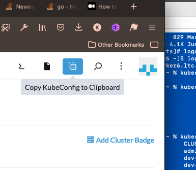

<!-- SPDX-License-Identifier: MPL-2.0 -->

# Base VM Initialization

> Scripts, configs, and Ansible modules for brand-new VM's

Follow these initial steps to prepare base image (brand new image provisioned by ITS) to be added to a cluster.

## Tool Requirements

* Ansible
* Vault

## Initial Steps

1. Install Ansible

    ```bash
    brew install ansible
    ```

1. [Download and install Vault](https://www.vaultproject.io/downloads) and set a VAULT_TOKEN

    ```bash
    vault login -method=ldap username={yourBcitEmail}

    export VAULT_TOKEN={YourToken}
    ```

1. Retrieve and store a local copy of the current inventory

    ```bash
    mkdir ~/.ansible && \
    curl \
      --header "X-Vault-Token: $VAULT_TOKEN" \
      $VAULT_ADDR/v1/ltc-infrastructure/data/inventory \
      > ~/.ansible/hosts.json
    ```

1. Retrieve and store a local copy of the `ansible` user credentials

    ```bash
    curl --header "X-Vault-Token: $VAULT_TOKEN" \
        $VAULT_ADDR/v1/ltc-infrastructure/data/ansible | jq -r '.data.data' > out.json && \
        cat out.json | jq -r '.id_rsa' > ~/.ansible/id_rsa && \
        cat out.json | jq -r '.["id_rsa.pub"]' > ~/.ansible/id_rsa.pub && \
        ANSIBLE_BECOME_PASSWORD=$(cat out.json | jq -r '.ansible_become_password') && \
        rm out.json && \
        echo -e "\n\n--- ANSIBLE_BECOME_PASSWORD: $ANSIBLE_BECOME_PASSWORD\n\n"
    ```

1. Confirm that you can list an inventory group

    ```bash
    ansible-inventory -i ~/.ansible/hosts.json --graph production
    ```

1. Confirm you can ping the inventory

    ```bash
    ansible-playbook -i ~/.ansible/hosts.json -l prod_01 00_ping.yaml
    ```

### Add Ansible User

**These instructions assume you have an account on the newly-provisioned VM.** See ansible-1st.md for info.

## All Nodes: Add packages

**Limit the hosts you are modifying:** Specify a group limit in your commands with `... -l {groupName}`.

1. Add packages, fix domain issue, and update (includes a reboot)

    ```bash
    ansible-playbook 02_add_packages.yaml -l prod_01
    ansible-playbook 03_update_domain.yaml -l prod_01
    ansible-playbook 04_add_lvm_device.yaml -l prod_01
    ansible-playbook 05_update.yaml -l prod_01
    ```

1. Add epel and jq

    ```bash
    ansible-playbook install_epel_jq_unzip.yaml
    ```

## Kubernetes Nodes: configure storage and RKE2

1. Add iscsi, nfs-utils

    ```bash
    ansible-playbook storage/install_storage_packages.yaml -l phase5\:\&staging
    ```

1. Configure LVM device

    ```bash
    ansible-playbook storage/install_storage_packages.yaml -l phase5\:\&staging

    ansible-playbook storage/add_lvm_device.yaml -l phase5\:\&staging
    ```

1. Install RKE2 using "ansible-rke2" module

    > See `rke2-ansible/README.md` for instructions

1. Retrieve KUBECONFIG file and merge it with your existing `~/.kube/config` to be able to run `kubectl` commands

    1. Login to [Rancher](https://rancher2.ltc.bcit.ca).
    1. Retrieve KUBECONFIG

        

    1. Merge into your existing `~/.kube/config` file

        ```bash
        cp ~/.kube/config ~/.kube/config.bak && KUBECONFIG=~/.kube/config:/path/to/new/config kubectl config view --flatten > /tmp/config && mv /tmp/config ~/.kube/config
        ```

## License

This Source Code Form is subject to the terms of the Mozilla Public License, v2.0. If a copy of the MPL was not distributed with this file, You can obtain one at <https://mozilla.org/MPL/2.0/>.

## About

Developed in 🇨🇦 Canada by [BCIT's](https://www.bcit.ca/) [Learning and Teaching Centre](https://www.bcit.ca/learning-teaching-centre/). [Contact Us](mailto:ltc_techops@bcit.ca).
